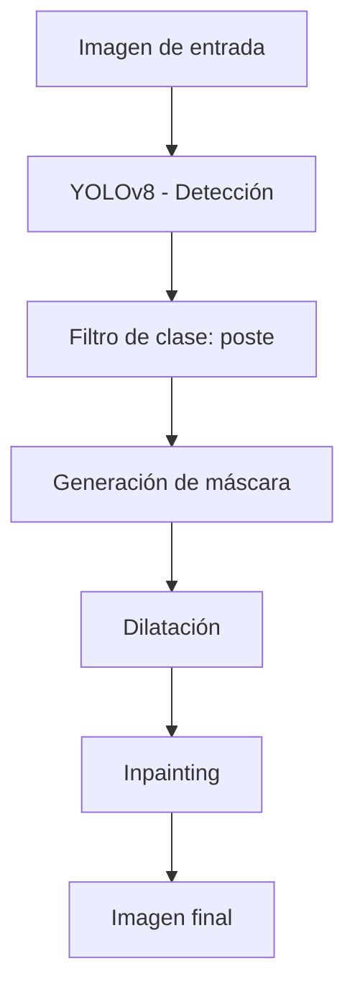

# 🏙️ Detección de Fachadas y Eliminación de Postes

### YOLOv8 + Inpainting + FastAPI

---

## 🧠 Integrantes:

JHEANSEL BELTRAN
LEONARDO FAJARDO 

Aplicaciones de aprendizaje de máquina 2026-1. UR.

## 🚀 Descripción

Este proyecto implementa un **pipeline completo de visión por computador** para:

* 🔍 Detectar **fachadas (casas)** y **postes**
* 🎯 Generar **máscaras automáticas**
* 🧩 Eliminar postes mediante **inpainting**
* 🌐 Exponer el proceso como **API REST con FastAPI**

> 💡 Objetivo: mejorar visualmente imágenes urbanas eliminando elementos no deseados de forma automática.

---

## 🧠 Pipeline del sistema



---

## 🎯 Objetivos

* Detectar automáticamente **fachadas y postes**
* Generar máscaras de los objetos a eliminar
* Aplicar técnicas de **inpainting**
* Construir un pipeline reproducible
* Exponer el sistema mediante API

---

## 🗂️ Estructura del proyecto

```bash
src/
├── train_yolo.py       # Entrenamiento del modelo
├── inferencia.py       # Pipeline principal
├── utils.py            # Funciones auxiliares
└── api.py              # API con FastAPI

models/
└── casas_postes_v1/
    └── weights/

data/
└── casas.yolov8/

outputs/
├── predicciones/
├── mascaras_postes/
└── resultados_inpainting/
```

---

## ⚙️ Instalación

```bash
git clone <REPO_URL>
cd <REPO>

python -m venv .venv
source .venv/bin/activate  # Linux/Mac
# .venv\Scripts\activate   # Windows

pip install -r requirements.txt
```

---

## 📦 Dependencias principales

* YOLOv8 (Ultralytics)
* OpenCV
* NumPy
* FastAPI
* Uvicorn

---

## 🧪 Uso

### 🔹 Entrenamiento

```bash
python src/train_yolo.py \
  --data data.yaml \
  --model yolov8n.pt \
  --epochs 50 \
  --imgsz 640 \
  --batch 16
```

---

### 🔹 Inferencia

#### Solo detección

```bash
python src/inferencia.py --modo detectar
```

#### Generar máscaras

```bash
python src/inferencia.py --modo mascaras
```

#### Inpainting

```bash
python src/inferencia.py --modo inpaint
```

#### Pipeli
